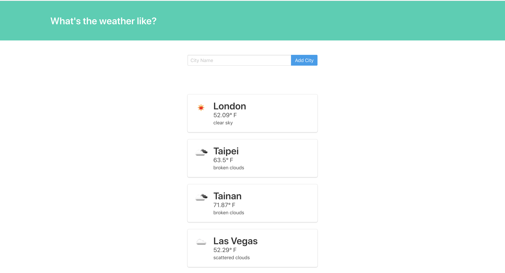

# weather-app
Weather Dashboard based on flask and openweather api.

# How to use
`$ flask run `  
成功執行時會出現  * Running on http://127.0.0.1:5000/ (Press CTRL+C to quit)  

# Weather首頁
- 顯示城市天氣的Dashboard
- 可以自行新增城市

